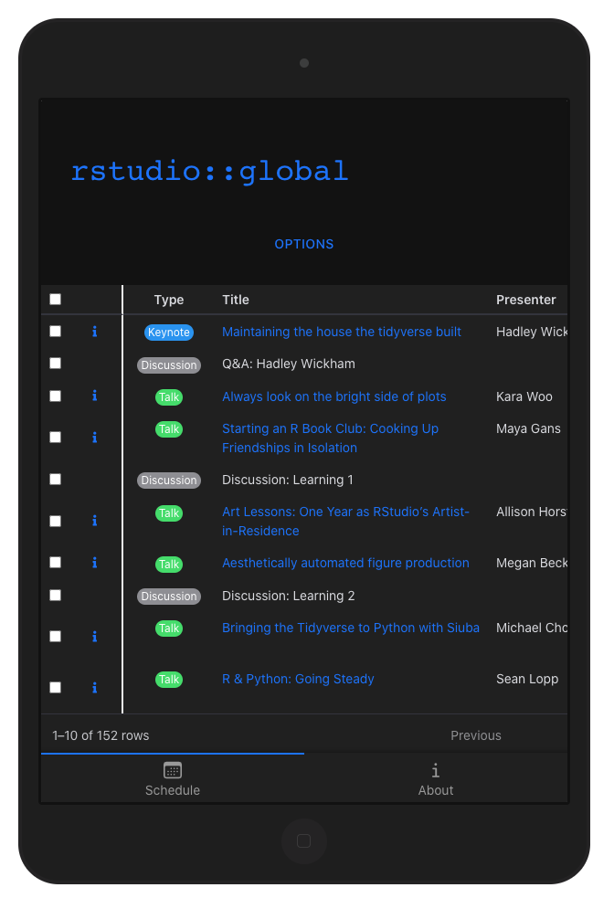
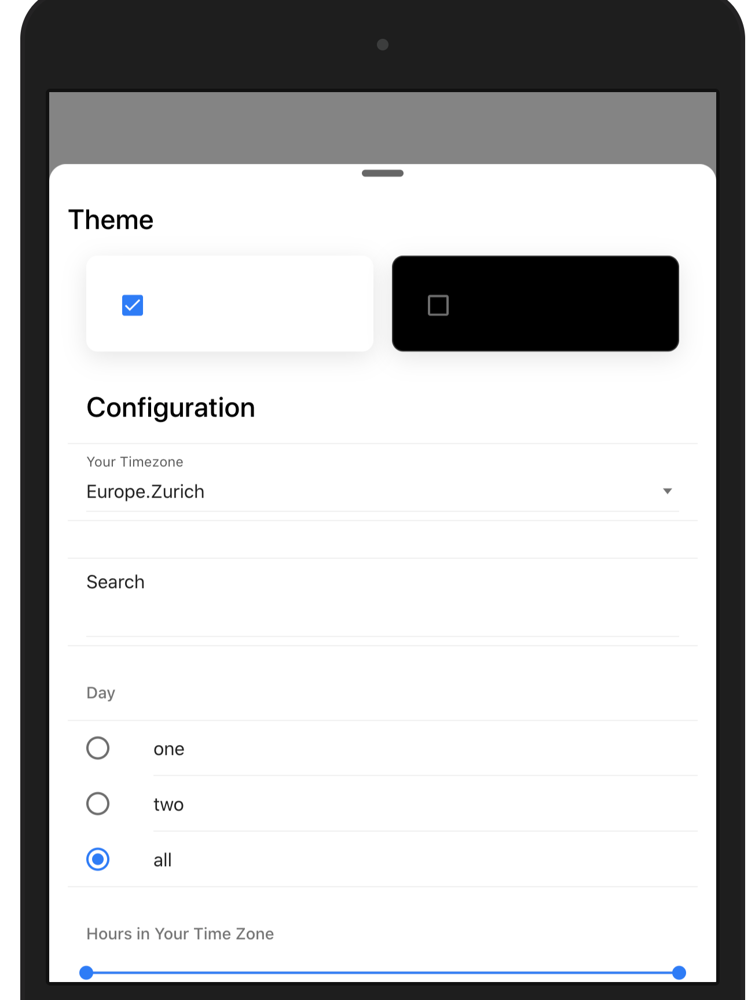

# A Talk Explorer for rstudio::global(2021): {shinyMobile} version

<!-- badges: start -->
<!-- badges: end -->

A little Shiny app that makes it easy to build your schedule for [rstudio::global](https://global.rstudio.com).

Run it locally:

```r
shiny::runGitHub("rstudio-global-2021-calendar", "divadnojnarg", ref = "shinyMobile")
```

This app is a hybrid web app, which you can install on any mobile platform, with the 
"add to homescreen feature". See [instructions](https://rinterface.github.io/shinyMobile/#add-the-pwa-to-your-desktop-apps).





You may run the original app by [Garrick](https://github.com/gadenbuie/rstudio-global-2021-calendar):

```r
shiny::runGitHub("rstudio-global-2021-calendar", "gadenbuie", ref = "main")
```

## Uses

- [shiny](https://shiny.rstudio.com) ([dev version](https://github.com/rstudio/shiny))
- [shinyMobile](https://rinterface.github.io/shinyMobile/)
- [reactable](https://glin.github.io/reactable/)
- [renv](https://rstudio.github.io/renv/)
- [calendar](https://github.com/ATFutures/calendar)

## Thanks

Thanks to  Silvia Canelon for outlining how to create a calendar event from the rstudio::global schedule in [spcanelon/rstudio-global-2021-calendar](https://github.com/spcanelon/rstudio-global-2021-calendar).
